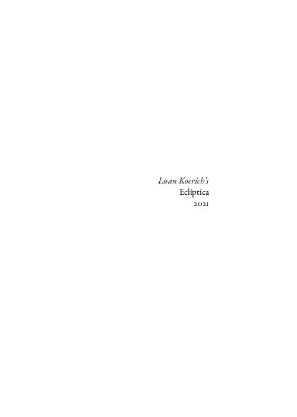
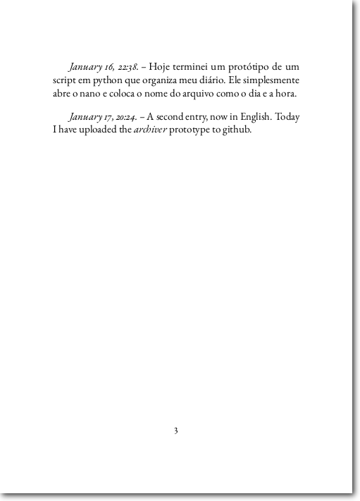

# archiver
A Python3 script to write down daily notes in an organized manner.

## Introduction
This python3 script was born from a friend's need to have an app that takes in his daily notes directly from a terminal and organizes it for you. We had different ideas on how to create this app, and this python script is my approach.

When invoking the *archiver*, it will automatically open your preferred editor (nano, vim, or whatever else) and save your input into an organized *.tex* file, in a folder of your preference. Then, if you want, the script will generate a compilable *.tex* file with all your daily entries in the folder and compile it with *pdflatex*.

The folder wherein to store your entries, to store the *.tex* and *.pdf* files, as well as the author's name and preferred editor, are stored in the *archiver.config* file, which is generated automatically for you when using the script for the first time. The final *.tex* file is generated based on the *preamble.tex* file, which you can customize as you want.

## archiver.config
The *archiver.config* should look like below. Please use absolute paths of directories, and create them before using the script; it will not generate folders automatically.

```bash
Directory to store entries: /home/<user>/<save_directory>
Directory to tex file: /home/<user>/<tex_directory>
Author name: <author>
Title: <title>
Preferred editor: nano
```

The script will look for the *archiver.config* file in the directory it is stored. If the *config* file is not present, the script will open nano and allow you to fill in the required fields.

## LaTeX template
A *preamble.tex* contains the usual LaTeX preamble that I use for my notes. It is customizable to what you want. Just make sure that it contains only **style** and **general type-setting** commands; the author, title and date information, as well as the document's begin and end points, are added by the script.

The template I like using for my notes is very minimalistic, as shown in the images. My notes are called *Eclíptica*, but you can specify your title and author name in the *archiver.config* file. The year is set automatically.





## Pre-requisites
The python3 script is based mainly on built-in libraries, but it requires the installation of the *glob* library. The way I like to install python3 packages is via *pip*

```bash
pip3 install -U glob
```

It also requires a bunch of LaTeX packages, which are probably installed by the distribution you already have. Otherwise, you can install tex-live's full scheme, which is always what I do. 

## Installation
To run the script from anywhere in your terminal, you can add a symbolic link of the *archive.sh* bash script to your */usr/bin* folder.

First, open your *archive.sh* bash script. It looks like this
```bash
#!/bin/bash
cd <installation_folder>
python3 ./archiver.py
```
Change *<installation_folder>* to the folder into which you copied *archiver.py*.

Create a symbolic link of *archiver.sh* to */usr/bin* as
```bash
ln -s <installation_folder/archive.sh> /usr/bin/archiver
```
